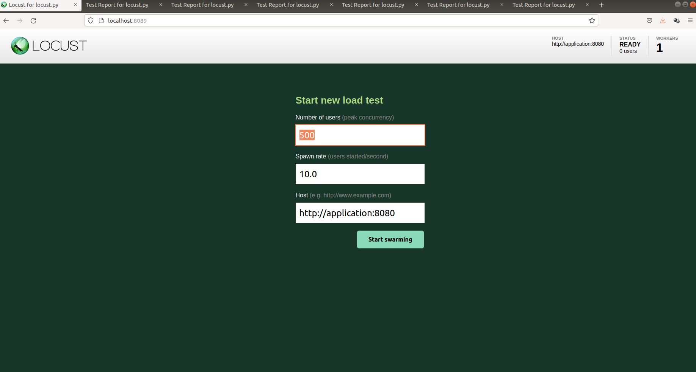

# Projeto Prático Tópicos em banco de dados
### Aplicação de Mensageria - Grupo 8

O projeto consiste em desenvolver uma aplicação que utiliza banco de dados NoSQL, cuja funcionalidade principal consiste na troca de mensagens entre usuários. A partir dessa aplicação gostaríamos de verificar como o comportamento do sistema varia conforme as configurações do banco de dados são modificadas.

# Rodando com Docker

## Pré-requisitos

* Instalar docker e docker-compose

## Realizando build da imagem da aplicação

* Executar o script **build_image.sh** na raiz do projeto.
* Execute este comando sempre que fizer alterações no código para atualizar o conteúdo do container responsável pela aplicação.

## Executar a aplicação

* Executar **docker-compose up** na raiz do projeto
* Instalar biblioteca requests do python

## Executar o teste com a aplicação cliente

* Executar **python3 setup_test.py** na raiz do projeto
* Executar **python3 app_test.py** na raiz do projeto (usuários cadastrados: joao, eduardo e patricia)

# Executar os testes de performance com o Locust

* Na pasta performance existem pastas para cada grupo de teste.
* Os testes estão organizados em grupos como segue:
  * same_room_write: Testes de Escrita em Única Sala.
  * same_room_read: Testes de Leitura em Única Sala.
  * different_room_write: Testes de Escrita em Múltiplas Salas.
  * different_room_read: Testes de Leitura em Múltiplas Salas.
* Dentro de cada diretório de grupo de testes estão as pastas com os casos de teste.
* Para iniciar o Locust execute dentro da pasta do caso de teste desejado o comando ```docker-compose up ```.
* Após executar o comando, aguarde alguns segundos para os containers serem inicializados. 
* Quando totalmente iniciados, abra um browser e entre no caminho: http://localhost:8089/ .
* A página do Locust abrirá com a sugestão das variáveis presentes no arquivo de configuração.



* Basta clicar no botão "Start Swarming" e os testes serão inicializados.
* Certifique-se que o arquivo "credentials" com as informações sobre o banco de dados está na raiz do projeto. Este arquivo deve conter os parâmetros MONGODB_HOST, MONGODB_SERVER e MONGODB_CONNECTION_STRING de acordo com as configurações do cluster do Atlas ou do servidor de banco de dados que estiver sendo utilizado.
* Execute o teste pelo tempo desejado. É possível interromper o teste a qualquer momento utilizando a interface web do Locust bem como fazer download de relatórios em CSV e/ou HTML com os resultados obtidos.


## Colaboradores em ordem alfabética
[](http://github.com/egnascimento) Eduardo Garcia do Nascimento

[](http://github.com/pmm182) Patrícia Megumi Matsumoto

## Agradecimentos
Agrademos à [Profa. Sahudy Montenegro Gonzales](https://www.linkedin.com/in/sahudy-montenegro-gonzalez/) pela movitação para este trabalho, orientação e ensinamentos durante as aulas da matéria "Tópicos em Banco de Dados" do Programa de Pós graduação em Ciências da Computação da UFSCar.
